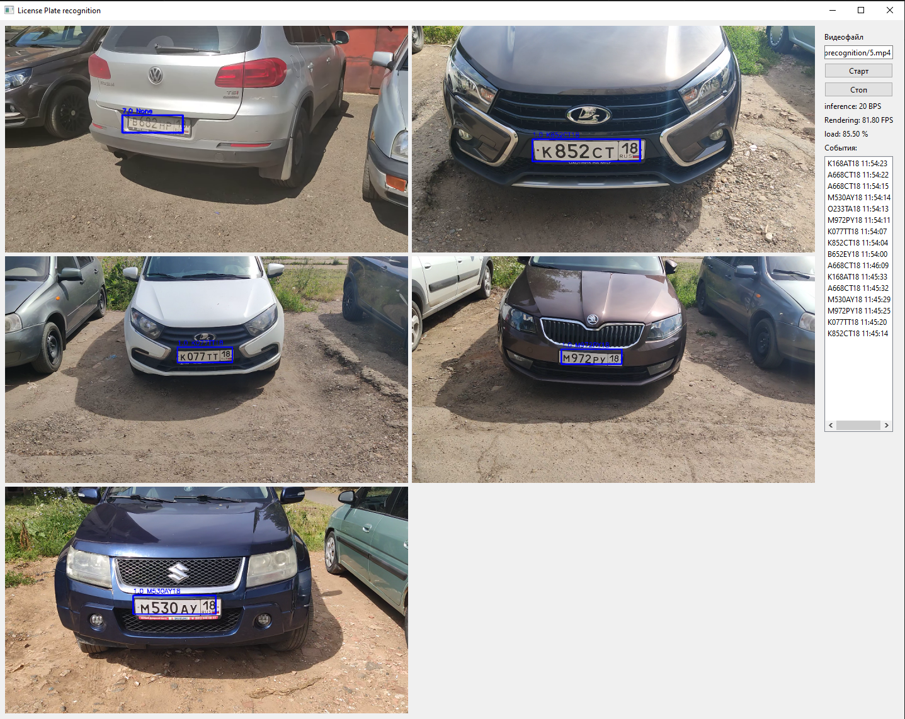

### Автоматическое детектирование и распознавание автомобильных номеров

Проект представляет собой приложение на PyQT, которое использует различные модели машинного обучения для автоматического детектирования и распознавания автомобильных номеров.

### Содержание
- [Описание](#Описание)
- [Технологии](#Технологии)
- [Пример работы](#Пример-работы)
- [Обучение моделей](#Обучение-моделей)
- [Требования к системе](#Требования-к-системе)
- [Установка на Windows](#Установка-на-Windows)
- [Сборка приложения](#Сборка-приложения)


### Описание проекта
Приложение позволяет загружать изображения и видео, детектировать номерные знаки, распознавать текст на них и сохранять результаты в базу данных.
Также реализован функционал трекинга объектов в видео потоке. Для оптимизации инференса используется собственный многопоточный инференс-сервер с батчингом и ONNX Runtime.
Инференс-сервер позволяет одноврменно запсукать несколько видеопотоков в реальном времени, объединив инференс моделей.
Презентация проекта: [here](./presentation.pdf)

### Технологии
Проект включает в себя следующие компоненты:
- YOLOv11 nano для детектирования номерных знаков
- LPRNet для распознавания текста на номерах
- STN для улучшения качества изображений перед распознаванием
- ByteTrack для трекинга объектов в видео
- Постобработка результатов OCR
- SQLAlchemy для работы с базой данных
- Onnxruntime для оптимизации инференса моделей
- Собственный инференс сервер: Многопоточный с поддержкой батчинга, менеджментом моделей.
- PyQt для создания пользовательского интерфейса
- Pyinstaller для сборки исполняемого файла


# Обучение моделей
Для обучения моделей, используются отдельные скрипты. Вы можете найти их в следующих репозиториях:
- YOLOv11: https://github.com/AntoxaZ18/lpr_detect
- LPRNet: https://github.com/AntoxaZ18/lprnet_ocr 

# Требования к системе
- ОС Windows 7 и выше
- Python 3.11 или выше
- poetry менеджер пакетов
  
# Установка на Windows
1. Клонируйте репозиторий:
   ```Powershell
   git clone https://github.com/AntoxaZ18/lprecognition.git
   cd lprecognition
   ```
2. Установка при помощи пакетного менеджера
   Если хотите чтобы вирутальная среда создалась в папке с проектом
   ```Powershell
   poetry config settings.virtualenvs.in-project true
   ```
   Создайте преднастроенную виртуальную среду
   ```Powershell
   poetry install
   ```
   Активируйте среду при помощи poetry (опционально)
   ```Powershell
   poetry env activate
   ```

# Пример работы


# Сборка приложения
   Для сборки exe файла (будет находиться в папке dist) выполните:
   ```Powershell
   poetry run build.py
   ```
